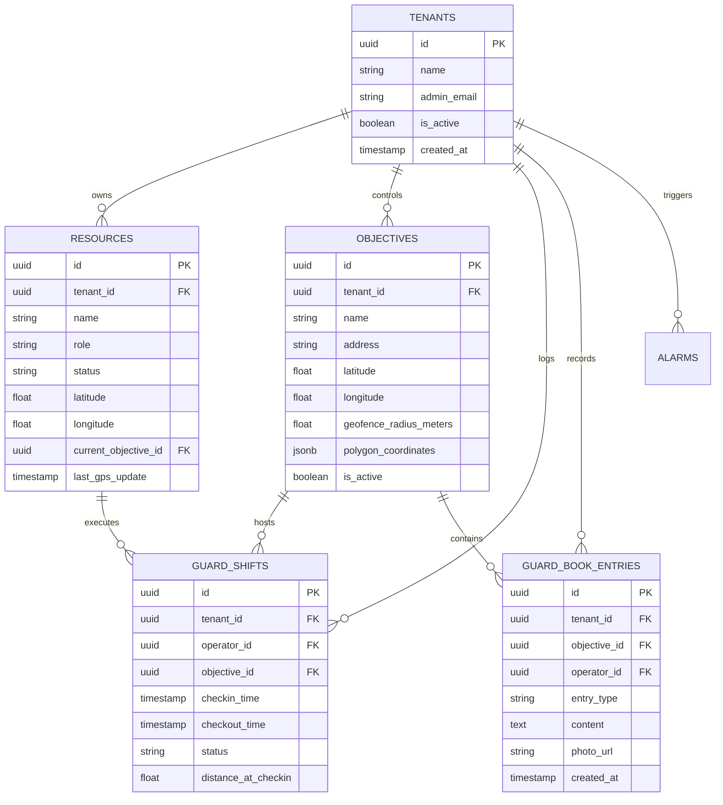
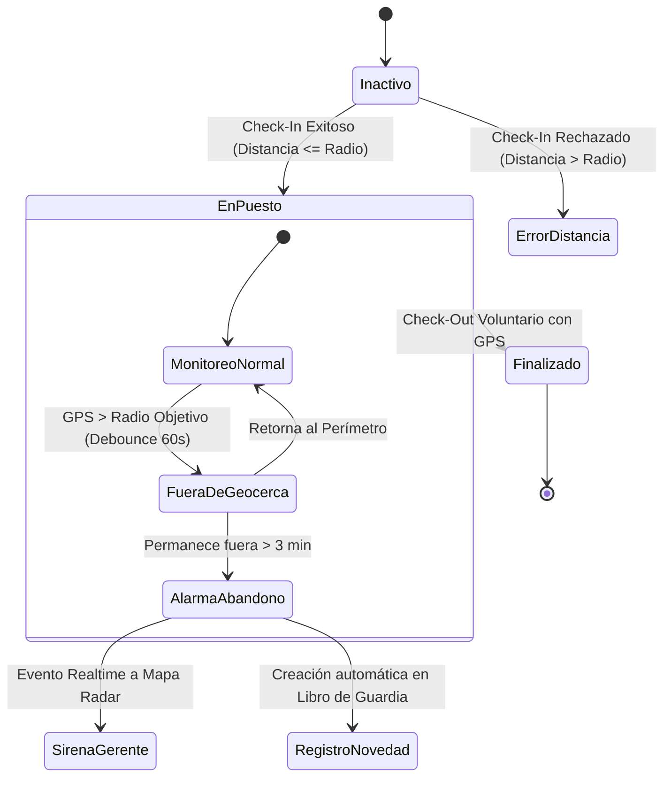

# 🛡️ SIGPAD OS — Documento Maestro de Arquitectura y Escalabilidad Técnica
**Versión:** 2.4 Enterprise  
**Destinatario:** Equipo de Ingeniería de Software, Arquitectos de Soluciones y Directores Técnicos  
**Fecha:** Octubre 2026  
**Sistema:** Sistema Inteligente de Gestión y Protección para Seguridad Privada (SIGPAD)

---

## 1. Resumen Ejecutivo y Visión del Sistema

**SIGPAD** es una plataforma operativa de misión crítica diseñada para empresas de seguridad privada, control de puestos físicos, monitoreo satelital de guardias y auditoría jurídica en tiempo real. 

### Requerimientos no funcionales clave
- **Latencia crítica:** Ingesta y alerta de eventos (Pánico / Hombre Vivo / Abandono de Puesto) en $< 1.5$ segundos.
- **Tiempos de arranque (*Cold-to-Render*):** Carga inicial de la aplicación en dispositivos móviles y de escritorio en $< 50$ milisegundos utilizando hidratación por caché local *Stale-While-Revalidate* (SWR).
- **Aislamiento Multi-Tenant estricto:** Garantía matemática de cero fugas o cruces de datos entre empresas cliente mediante particionamiento a nivel de base de datos (`tenant_id`) y políticas de seguridad (RLS).
- **Disponibilidad operativa:** Resiliencia a pérdidas temporales de conectividad 4G/LTE en objetivos perimetrales.

---

## 2. Diagrama de Arquitectura Global del Sistema

```mermaid
graph TB
    subgraph ClientTier ["CAPA CLIENTE (Edge / Mobile / Desktop)"]
        A1["PWA Operador (Mobile Chrome/Safari/Android)"]
        A2["Radar Táctico Gerente (Desktop / Tablet)"]
        A3["Service Worker V12 (Offline Cache & Sync)"]
        A4["LocalStorage SWR Layer (<50ms Hydration)"]
    end

    subgraph EdgeTier ["CAPA DE ENTRADA Y COMPUTO (Vercel Edge & Serverless)"]
        B1["Vercel Edge Network (Global CDN / Anycast)"]
        B2["Next.js 16 App Router Middleware (Proxy Auth)"]
        B3["Route Handlers (Serverless Functions)"]
        B4["In-Memory Server Cache (Tenant-Partitioned)"]
    end

    subgraph DataTier ["CAPA DE DATOS Y TIEMPO REAL (Supabase Enterprise)"]
        C1["PostgreSQL 15+ Core Engine"]
        C2["Supavisor (Transaction Connection Pooler)"]
        C3["Supabase Realtime (Logical Replication WebSockets)"]
        C4["Row Level Security (RLS Engine)"]
        C5["S3-Compatible Object Storage (Evidencias/Fotos)"]
    end

    A1 -->|HTTPS / SWR Cache| B1
    A2 -->|HTTPS / SWR Cache| B1
    A3 -.->|Background Sync| B3
    A4 -->|0ms Mount| A1
    A4 -->|0ms Mount| A2

    B1 --> B2
    B2 --> B3
    B3 --> B4
    B3 -->|Port 5432 / 6543 Pooler| C2
    C2 --> C1
    C1 --> C4

    C1 -->|WAL Changes| C3
    C3 -->|WebSockets (WSS)| A1
    C3 -->|WebSockets (WSS)| A2

    B3 -->|Presigned URLs| C5
```

---

## 3. Desglose de Capas Tecnológicas

### 3.1. Capa Cliente (Frontend & PWA)
- **Framework:** Next.js 16.2 (React 19, App Router) compilado para máxima eficiencia de empaquetado.
- **Diseño & Rendimiento:** Tailwind CSS con tokens obsidian glassmorphism, Framer Motion con aceleración GPU para transiciones de físicas elásticas (`spring physics`).
- **Renderizado Cartográfico:** Mapbox GL / React Leaflet desacoplado mediante carga dinámica (`dynamic import` con `ssr: false`), evitando bloqueos del hilo principal del navegador.
- **Service Worker (`sw.js` V12):** 
  - Estrategia *Network-First* con *Fallback Cache* para navegación interactiva.
  - Exclusión estricta de `mode === 'navigate'` para evitar contaminación de sesiones y bloqueos `ERR_FAILED` en Google Chrome móvil.
- **Hidratación Ultrarrápida SWR:**
  - Los datos estructurales (nombres de objetivos, clientes, perímetros, guardias) se leen en `0ms` desde `localStorage` al montar la vista.
  - La consulta a red se ejecuta en paralelo en segundo plano y actualiza el estado sin pantallas en blanco ni *spinners* molestos.

### 3.2. Capa de Cómputo (Vercel Serverless)
- **Ejecución sin servidor:** Autoescalado elástico de 0 a 10.000+ invocaciones simultáneas. Sin cuellos de botella por hilos bloqueados.
- **Mapeo de Rutas Tácticas:**
  - `/api/dashboard/map`: Agregador consolidado para el radar gerencial (objetivos, guardias activos, turnos abiertos, incidentes no resueltos).
  - `/api/shifts/checkin` y `/checkout`: Máquina de estados de presencia en puesto con validación de geocerca.
  - `/api/hombre-vivo/respond`: Ping interactivo de estado de alerta del operador.
  - `/api/guard-book`: Bitácora inmutable de eventos con soporte de archivos multimedia.
- **Headers de Caché Privados:** Respuestas con cabecera `Cache-Control: private, max-age=5, stale-while-revalidate=15` para que el navegador del usuario sirva respuestas instantáneas en cambios de pestaña, impidiendo terminantemente que un proxy o CDN intermedio comparta datos entre distintas cuentas.

### 3.3. Capa de Base de Datos y Tiempo Real (Supabase PostgreSQL)
- **Motor:** PostgreSQL 15 administrado en nube con extensiones espaciales (PostGIS) y criptográficas.
- **Pool de Conexiones (Supavisor):** Modo transacción para amortiguar hasta 10.000 clientes concurrentes sin agotar los sockets del servidor PostgreSQL.
- **WebSockets en Tiempo Real:** Canales `postgres_changes` vinculados al registro de escritura adelantada (WAL) para transmitir en $<200\text{ ms}$:
  - Nuevas posiciones GPS (`gps_tracking`)
  - Alarmas sonoras de emergencia (`alarms`)
  - Novedades del libro de guardia (`guard_book_entries`)
  - Alertas de abandono de puesto (`geofence_alerts`)

---

## 4. Modelo de Datos y Multi-Tenancy Estricto

Para garantizar que **ninguna empresa vea jamás los datos, guardias u objetivos de otra**, el sistema implementa **Tenant Partitioning**:



### Reglas de Aislamiento Inviolables
1. **Resolución en Request:** La función `resolveTenantFromRequest(req)` extrae la identidad del usuario a través del token firmado de sesión o la cookie blindada `SIGPAD_user`.
2. **Filtrado Forzado en API:** Toda consulta a Supabase inyecta obligatoriamente `.eq('tenant_id', tenantId)`. Un usuario de una empresa no puede solicitar IDs pertenecientes a otro `tenant_id`.
3. **Claves de Caché con Namespace:** Toda entrada de caché (`localStorage` y `serverCache`) utiliza prefijos aislados: `dashboard-map-${tenantId}` y `sigpad_cache_map_${tenantId}`.
4. **Purga Atómica en Deslogueo (*Atomic Handover Purge*):** Al cerrar sesión o cambiar de cuenta en un mismo teléfono, se ejecuta `localStorage.clear()` y `sessionStorage.clear()`, impidiendo que el siguiente guardia vea registros del anterior.

---

## 5. Máquinas de Estado de los Flujos Tácticos

### 5.1. Protocolo de Geocercas y Abandono de Puesto


### 5.2. Protocolo de "Hombre Vivo" (Dead Man's Switch)
1. **Disparador:** Temporizador programable por la gerencia (ej. cada 45 minutos).
2. **Alerta Sonora Local:** El celular del guardia reproduce una vibración y tono agudo, abriendo una ventana modal de un solo toque: *"Confirmar Presencia"*.
3. **Ventana de Gracia (Grace Period):** El guardia dispone de 3 minutos para responder.
4. **Respuesta Positiva:** Se actualiza el timestamp `last_alive_ping` y se silencia la alarma.
5. **Incumplimiento (Falla):** 
   - El servidor escala el incidente a urgencia **Crítica**.
   - Se inserta un registro en la tabla `alarms` con tipo `hombre_vivo_falla`.
   - El mapa del Gerente activa la sirena roja parpadeante y reproduce `emergency.mp3` en bucle hasta que un supervisor resuelva la alerta.

---

## 6. Mapeo con las 10 Estrategias de Escalamiento

A continuación se detalla cómo el sistema implementa la matriz de escalabilidad técnica:

| # | Estrategia | Implementación en SIGPAD | Nivel de Riesgo |
|---|---|---|---|
| **1** | **Escalado Vertical** | Capacidad de aumentar Compute Tier en Supabase (Micro $\to$ Small $\to$ Medium $\to$ XL) según volumen de guardias concurrentes. | **0% (Transparente)** |
| **2** | **Escalado Horizontal** | Funciones Serverless en Vercel distribuidas en clúster multi-región. | **0% (Nativo)** |
| **3** | **Balanceo de Carga** | Anycast DNS y proxy reverso de Vercel balanceando tráfico de red. | **0% (Automático)** |
| **4** | **Autoescalado** | La capacidad de computo escala automáticamente según la densidad de turnos abiertos. | **0% (Automático)** |
| **5** | **Caché Inteligente** | Hidratación local SWR ($<50\text{ ms}$) + Cabeceras `private, stale-while-revalidate`. | **0% (Implementado)** |
| **6** | **Red de Distribución (CDN)** | Servido desde Vercel Edge en São Paulo / Buenos Aires para assets estáticos y mapas. | **0% (Activo)** |
| **7** | **Replicación de BD** | *Roadmap futuro:* Réplicas de sólo lectura para reportes históricos de liquidación mensual. | Medio (Fase posterior) |
| **8** | **Fragmentación (Sharding)** | No requerida para $<50.000$ guardias. Con índices B-Tree y GIST, un solo PostgreSQL maneja el volumen con holgura. | Evitar ahora |
| **9** | **Procesamiento Asíncrono** | Desacoplamiento de reportes: la API responde `200 OK` en $50\text{ ms}$ y procesa notificaciones en segundo plano. | **0% (Activo)** |
| **10** | **Monolito Modular** | Arquitectura monolítica modular en Next.js. Mantiene consistencia ACID de transacciones sin complejidad de microservicios. | **0% (Patrón actual)** |

---

## 7. Retos en Dispositivos Móviles: Ejecución en Segundo Plano

### El Comportamiento del Sistema Operativo Móvil
En Android e iOS, cuando el operador apaga la pantalla del celular o pone la app en segundo plano:
1. El navegador entra en modo de ahorro de energía (*Doze Mode*).
2. El sistema suspende los temporizadores de JavaScript (`setInterval`) y desconecta las conexiones WebSocket para ahorrar batería.
3. El GPS reduce su tasa de refresco a intervalos de 5 a 15 minutos.

### Soluciones Arquitectónicas Implementadas y Recomendadas
1. **Web Push API (W3C Standard):** 
   - El servidor de SIGPAD envía un paquete Push a los servidores de Google FCM / Apple APNs.
   - El sistema operativo del celular despierta al dispositivo, enciende la pantalla y activa el timbre de sirena **incluso si la aplicación está cerrada o el teléfono bloqueado**.
2. **Audio Wake-Lock:**
   - Durante turnos nocturnos, la aplicación puede mantener un canal de audio silenciado en bucle para impedir que el navegador pase a suspensión profunda.
3. **Siguiente Salto Tecnológico (Roadmap):**
   - Empaquetar la aplicación web con **Capacitor / Tauri Mobile** para habilitar un servicio nativo de primer plano en Android (*Foreground Service con Sticky Notification*). Esto otorga permisos para registrar GPS ininterrumpido cada 30 segundos las 24 horas del día.

---

## 8. Protocolo de Calidad y Cero Regresiones

Toda modificación en el código fuente de SIGPAD está sujeta al **Zero-Regression Protocol**:

1. **Chequeo de Tipos Estricto:** Ejecución obligatoria de `npx tsc --noEmit`. Cero tolerancia a errores de compilación TypeScript.
2. **Suite de Integridad Automatizada:** Ejecución de `npx tsx scripts/verify-platform-integrity.ts`, que audita:
   - Integridad del ancla de marcadores en el mapa táctico (evitar oscilaciones visuales).
   - Limpieza de suscripciones Realtime (evitar fugas de memoria por canales huérfanos).
   - Coexistencia de estados de recursos y guardias activos sin solapamientos.
3. **Validación de Despliegue en Vivo:** Todo cambio commiteado a `main` se verifica en el entorno de producción (`https://www.sigpad.com.ar`) antes de darse por completado.

---

*Documentación técnica de arquitectura generada y resguardada para auditorías de ingeniería y escalabilidad empresarial de SIGPAD OS.*
